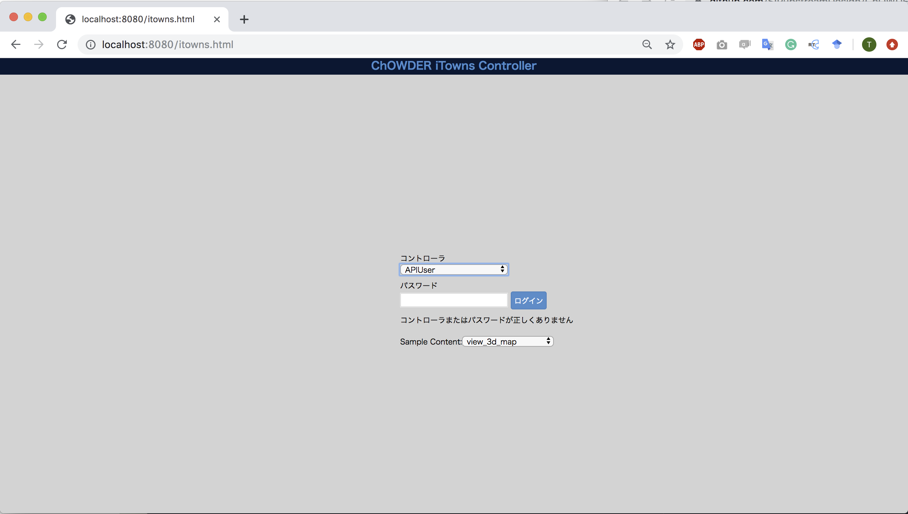
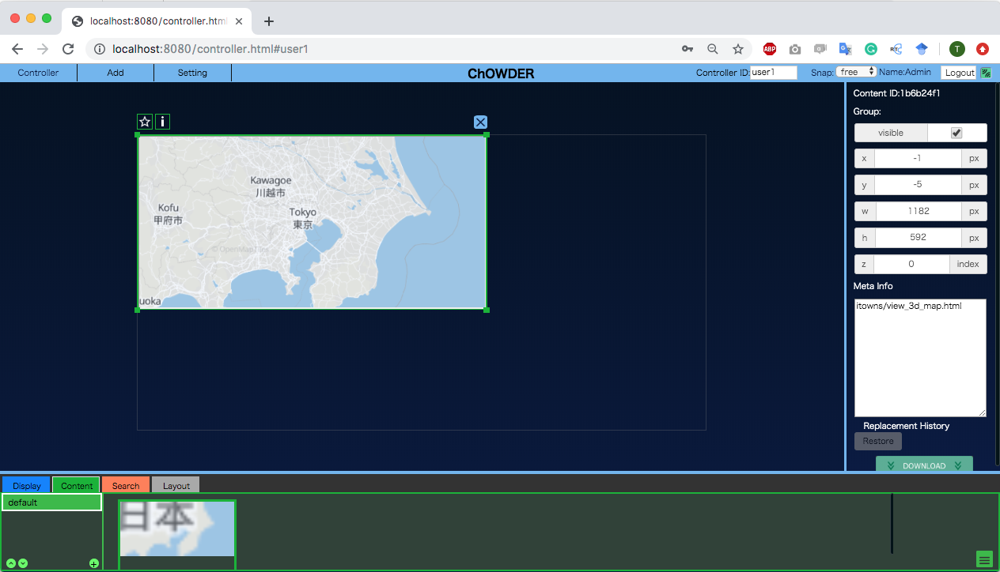
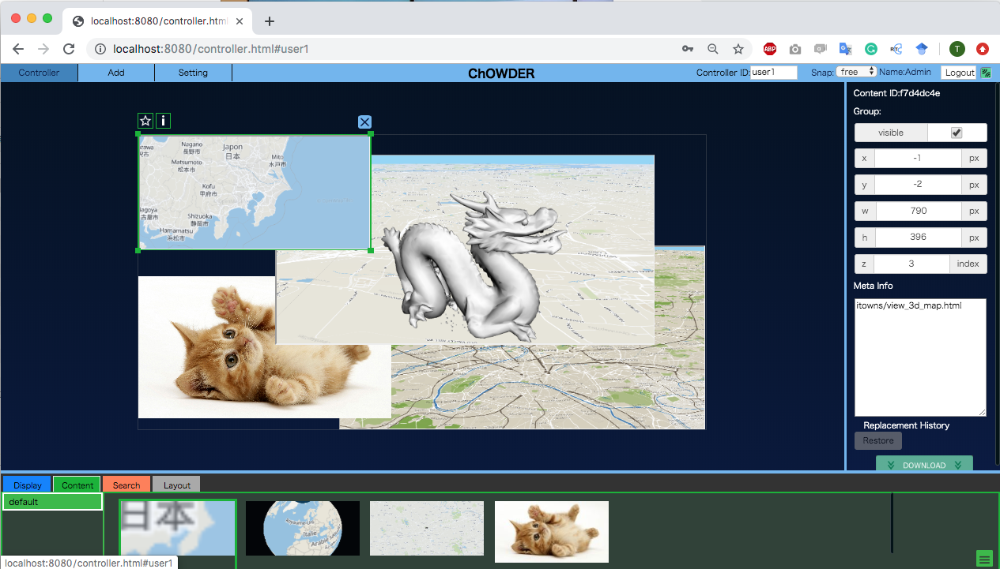

# 3D Web GIS tool integration


map data © [OpenStreetMap](http://www.openstreetmap.org) contributors

In this branch, we are implementing a prototype that displays 3D GIS data on the ChOWDER display.

# Demo video
Here is the demonstration video that displays Open Street Map in 3D on a ChOWDER tiled display with a horizontal resolution of 20K, which is distributed and rendered by 5 Mac minis.

[](https://www.youtube.com/watch?v=u3jdhZ1RnHs)


# Features

- Display GIS data as content on ChOWDER tiled display
  - Like content that could be displayed with ChOWDER, such as images, videos, and PDFs, GIS data can be displayed at any position on the tiled display and can be enlarged or reduced.
  
- Use [iTowns](http://www.itowns-project.org/) as the base GIS tool
  - 3D display of GIS data by WebGL + Three.js.
  
- WebGL distributed rendering
  - Each Web browser that makes up the tiled display renders the GIS data of the area in charge using WebGL. Thanks to this distributed rendering concept, rendering costs do not become a bottleneck even for ultra-large scale GIS data.
  
- GIS specific controller app
  - For GIS content requires user interaction such as changing the viewpoint, etc., it is operated in a web browser window that is separate from the standard ChOWDER controller. Since it runs on a web browser, no other specialized software is required.
  
- Displaying LoD (Level of Detail) linked to physical display resolution
  - GIS content displayed on a tiled display is not simply magnified. Depending on the physical resolution of the display device, LoD is also optimized.

# How to show GIS data on ChOWDER

## Preparation

First, install CHOWDER. Please refer to UsersGuide for ChOWDER installation and basic operation.
To use the GIS controller, you need to set a password for `APIUser`. Set the password by referring to the UserGuide above.

## Launch GIS controller

After starting the ChOWDER server, access the following URL from a web browser. `ChOWDER_SERVER_ADDRESS` is the IP address or hostname of the ChOWDER server you installed.
```
  http://ChOWDER_SERVER_ADDRESS:8080/itowns.html
```

Then the following screen will be displayed. Enter the `APIUser`'s password in the text box and press the blue button on the right side to log-in.


## Operate GIS data

Then, The Open Street Map centered on Tokyo should be displayed. The viewpoint can be changed with the same mouse operation as iTowns.


At the same time, the same GIS content is also displayed on the ChOWDER controller. Here you can move, enlarge, or reduce the GIS content.


There are three types of GIS content currently implemented: You can select from the pull-down menu on the login screen of the GIS controller.
1. view_3d_map
1. 3dtiles_basic
1. vector_tile_raster_3d

# Kitten!
And of course, now you can see multiple GIS data and a kitten image at the same time! ;-)

